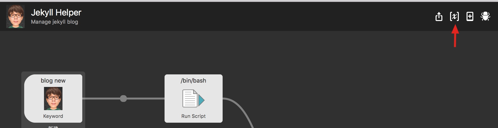
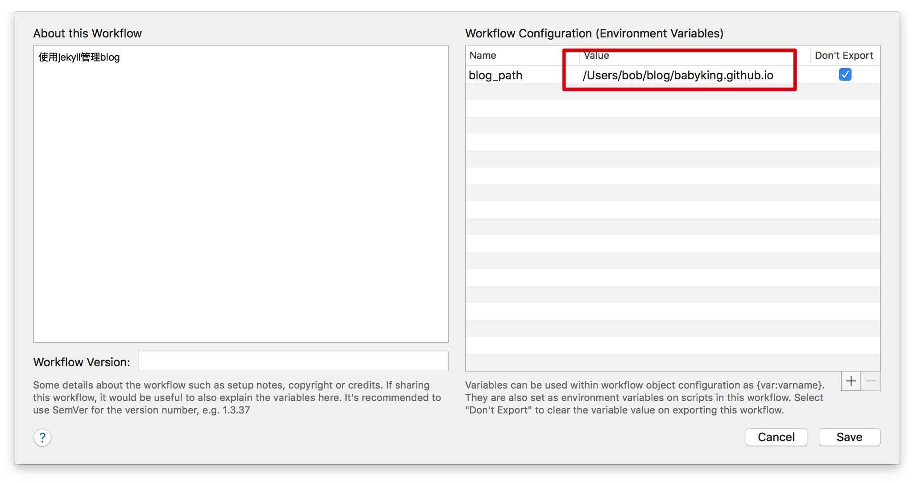
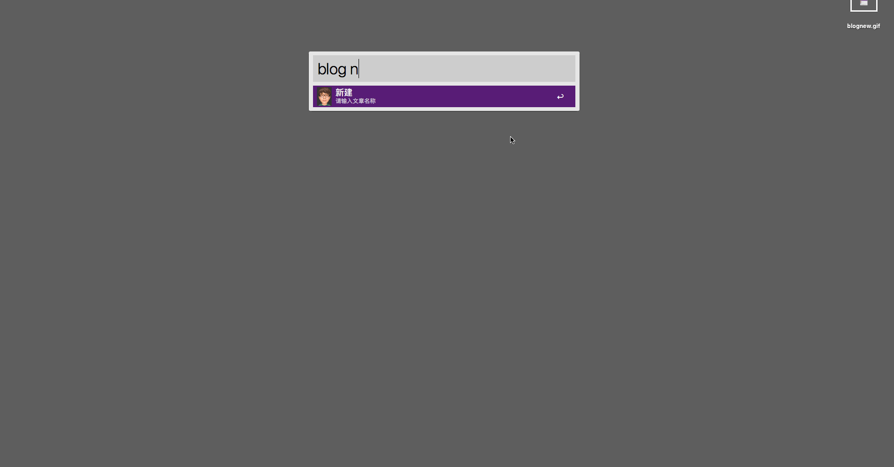
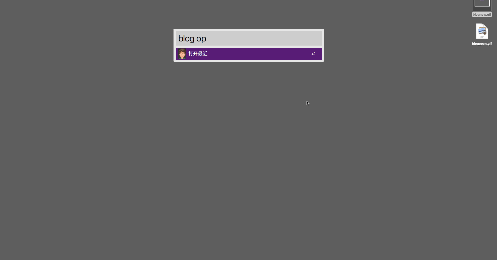
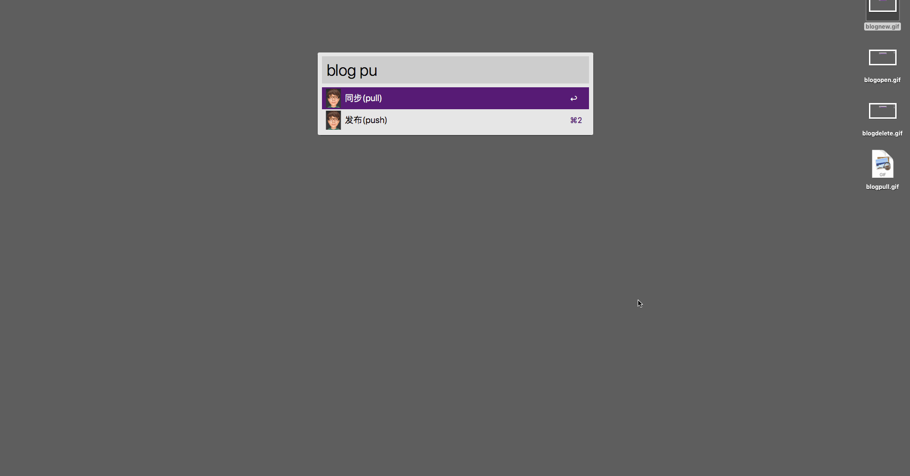

# Jekyll  Helper

[README-en](README.md)

Jeykyll Helper 是一个Alfred下的Workflow,对jekyll的日常操作提供了便捷方式.

1. 新建文章
2. 打开文章
3. 删除文章
4. 同步
5. 发布

## 配置

打开Jekyll Helper workflow的环境变量配置

增加 blog_path 环境变量,输入jekyll site所在路径

## 新建文章

blog new `文章名称`

文章名称会以 `年-月-日-wen-zhang-ming-chen.md ` 的形式生成文件名,并使用默认的编辑器打开文档.

## 打开文章

blog open

## 删除文章

blog delete

## 同步

blog pull

执行git pull操作

## 发布

blog push

执行git push操作

