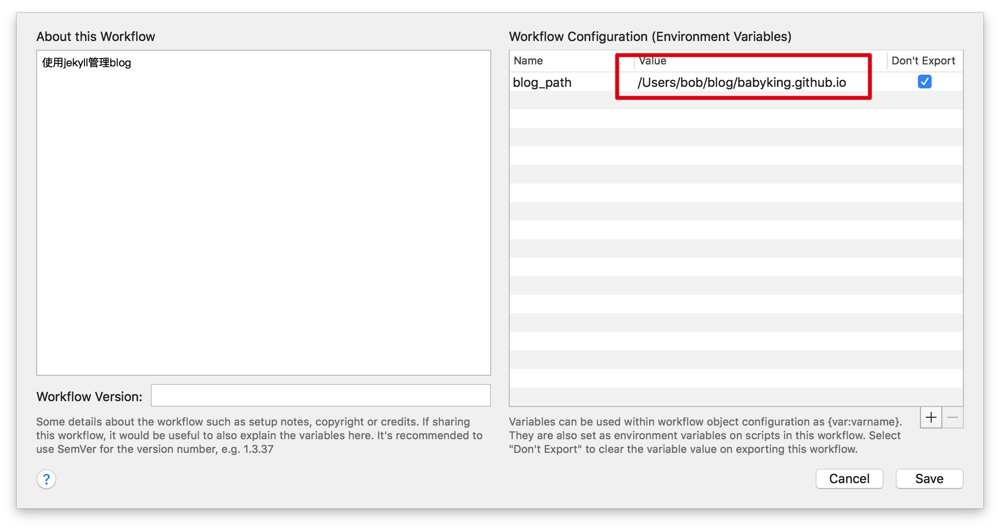
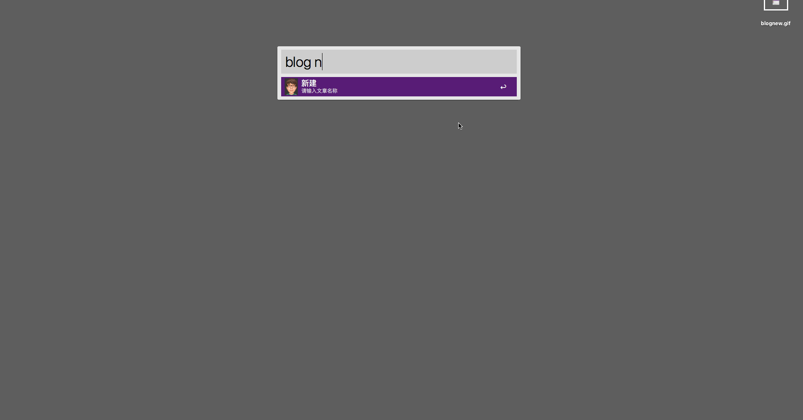
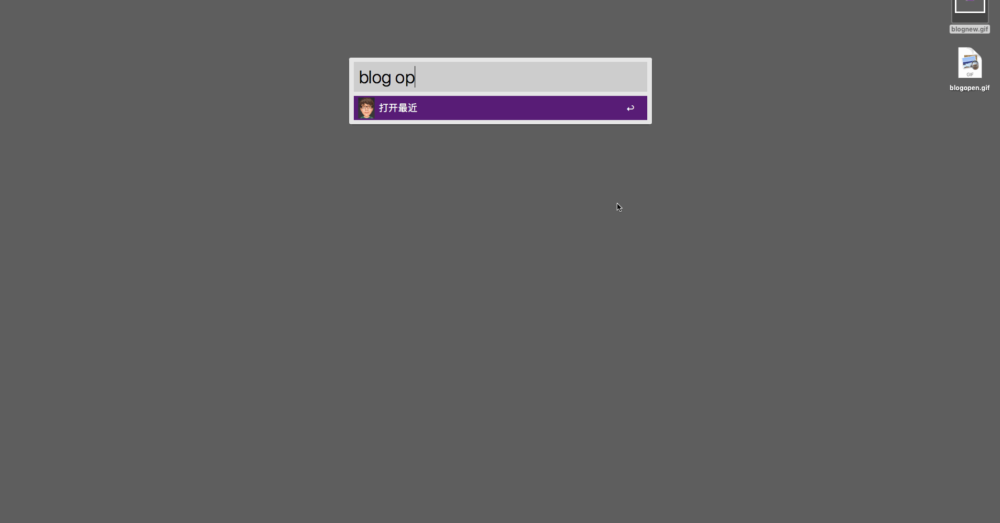
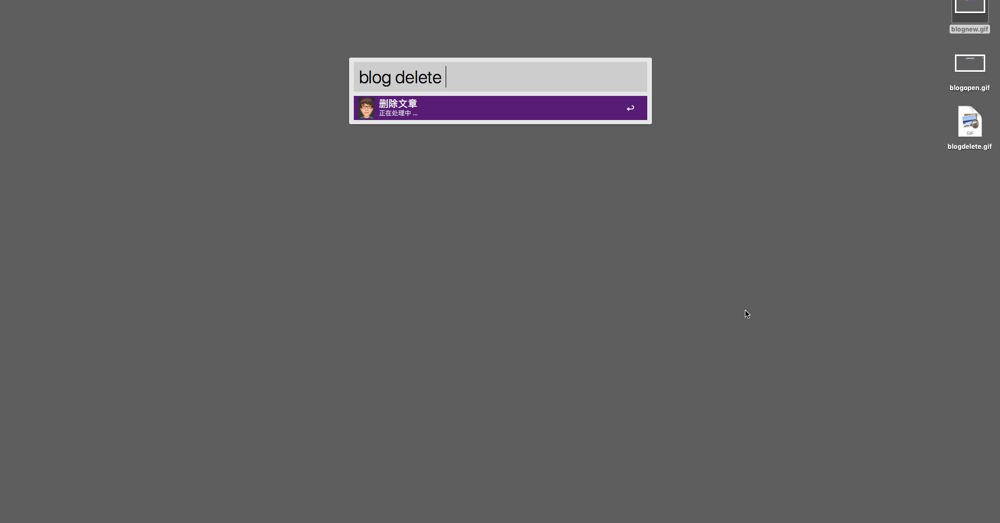
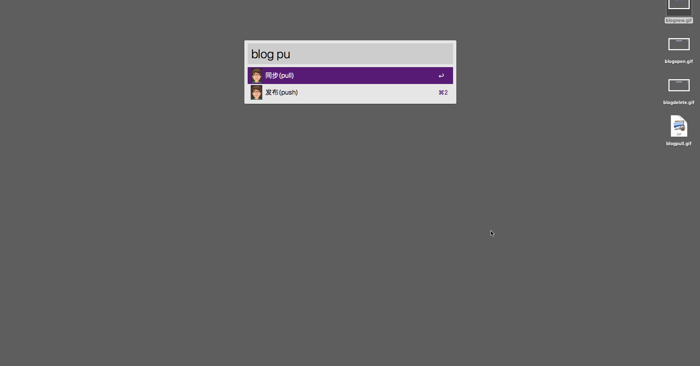
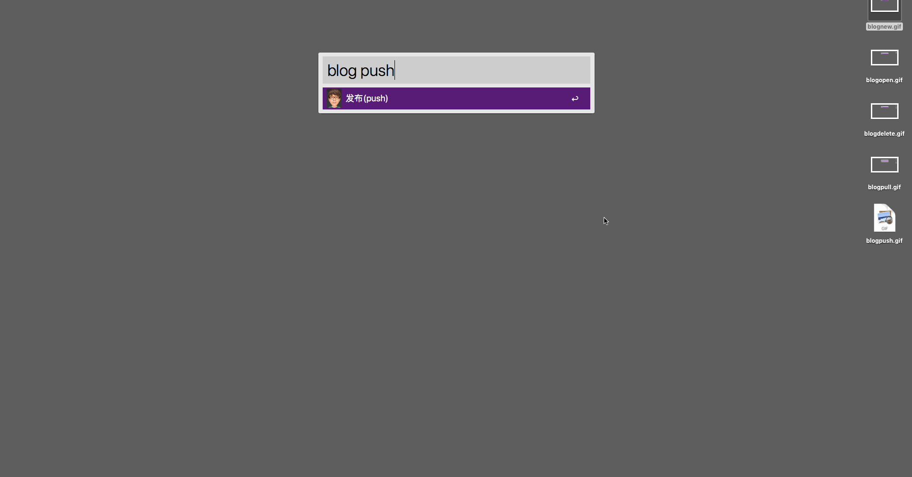

# Jekyll Helper

> [README中文版](README-CN.md)

Jeykyll Helper is a workflow under Alfred that provides a convenient way to jekyll's daily operations.

1. Create a new article
2. Modify the article
3. Delete the article
4. Sync
5. Depoly

## Configuration

Open the environment variable configuration of Jekyll Helper workflow

Adding the blog_path environment is also the path to enter the jekyll site

## New article

blog new `article name`

The article name will be generated in the form of 2018-10-10-article-name.md and the document will be opened with the system default editor.

## Open article

blog open

## Delete article

blog delete

## Sync

blog pull

Perform a git pull operation

## Depoly

blog push

Perform a git push operation

